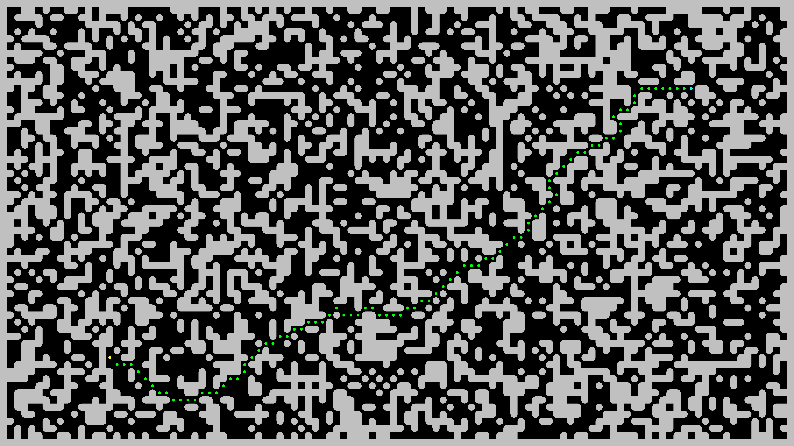
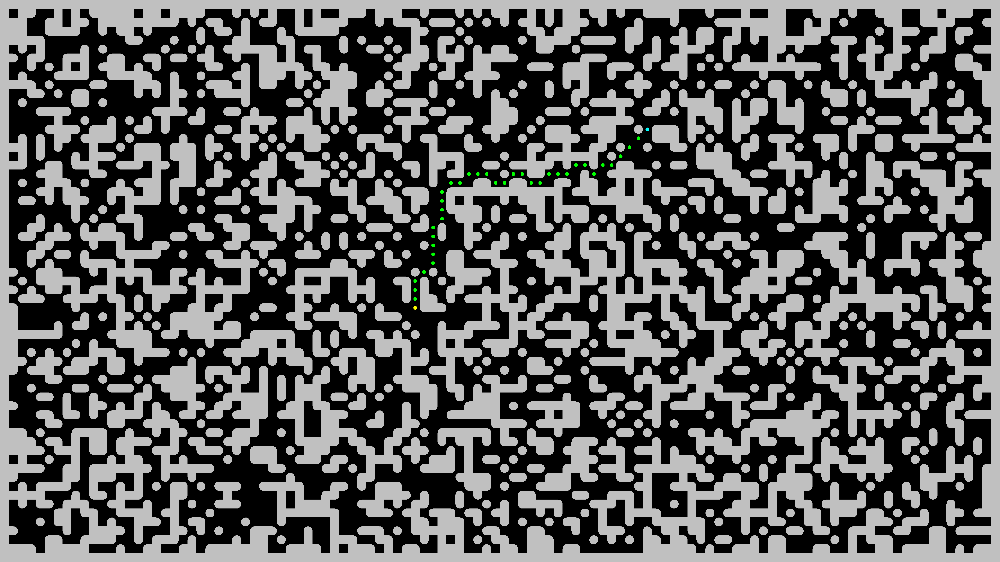
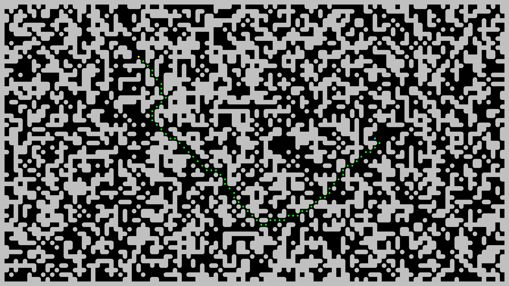

# Maze Demo

Find shortest path in a maze. The maze is represented with a matrix of square
walls and empty spaces. Moves are allowed from any empty space to any adjacent
empty space. All 8 directions are allowed. Horizontal or vertical move cost
is $1$. Diagonal move cost is $\sqrt{2}$.

Despite of irrational value above, the project demonstrates how the problem
could be solved using integer numbers only.

The demo generates a random maze, random start and stop points, computes the
shortest path between them and draws a picture. The picture could be found in
`picture.png` file after run.

# Prerequisites

The program is tested on Ubuntu 23.10 only.

Install `build-essential`, `gcc`, `cmake`, `make`, `imagemagick`. Use the
following command to install them on an Ubuntu machine.

```shell
$ sudo apt install build-essential gcc cmake make imagemagick
```

# Usage

```shell
$ ./run.sh
```

# Examples




